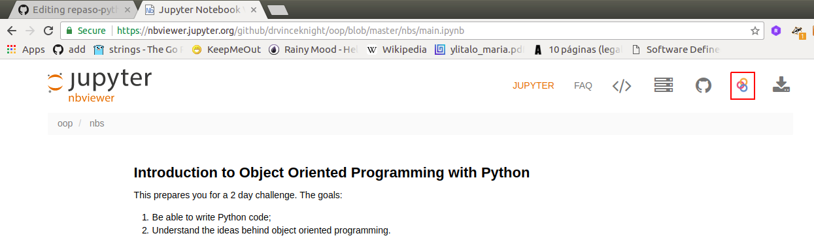

# Repaso python

## Objetivos ##
> 1. Comprender los conceptos necesarios para la codificación de programas en python.
> 2. Brindar las herramientas necesarias para el uso de python en el curso de IoT

## Actividad ##

Analizar el siguiente tutorial de python [Introduction to Object Oriented Programming with Python](https://nbviewer.jupyter.org/github/drvinceknight/oop/blob/master/nbs/main.ipynb) tomado del siguiente [repositorio]( https://github.com/drvinceknight/oop/blob/master/nbs/main.ipynb). Con el fin de que pueda correrlo online presione el botón **execute on binder** tal y como lo muestra la siguiente figura:

Sin embargo para ir mas a la fija, puede descargar el notebook y ejecutarlo en el servidor jupyter instalado en su maquina. manera local.

### Referencias adicionales ###

Con el fin de profundizar mas a fondo puede consultar en la pagina [Python Tutorial Series](https://github.com/zhiyzuo/python-tutorial) los siguientes temas:
1. [**Variables, Data Structures, and Control Logic**](https://nbviewer.jupyter.org/github/zhiyzuo/python-tutorial/blob/master/1-Variables-Data_Structures-Control_Logic.ipynb): Todo
2. [**Functions, File I/O and External Libraries**](https://nbviewer.jupyter.org/github/zhiyzuo/python-tutorial/blob/master/2-Functions-External_Libraries-File_IO.ipynb): Solo hasta la parte de
3. [**Visualization with Matplotlib and Seaborn**](https://nbviewer.jupyter.org/github/zhiyzuo/python-tutorial/blob/master/4-Visualization-with-Matplotlib.ipynb): (Opcional) Estudiar solo la parte de matplotlib.

## Enlaces web ##

1. [Introduction to Object Oriented Programming with Python](https://github.com/drvinceknight/oop/blob/master/nbs/main.ipynb)
2. [Tutorial de Python con Jupyter Notebook](https://facundoq.github.io/courses/aa2018/res/02_python.html)
3. [Python 3 OOP Notebooks](https://www.thedigitalcatonline.com/blog/2015/03/14/python-3-oop-notebooks/)
4. [Building Interactive Dashboards with Jupyter](https://blog.dominodatalab.com/interactive-dashboards-in-jupyter/)
